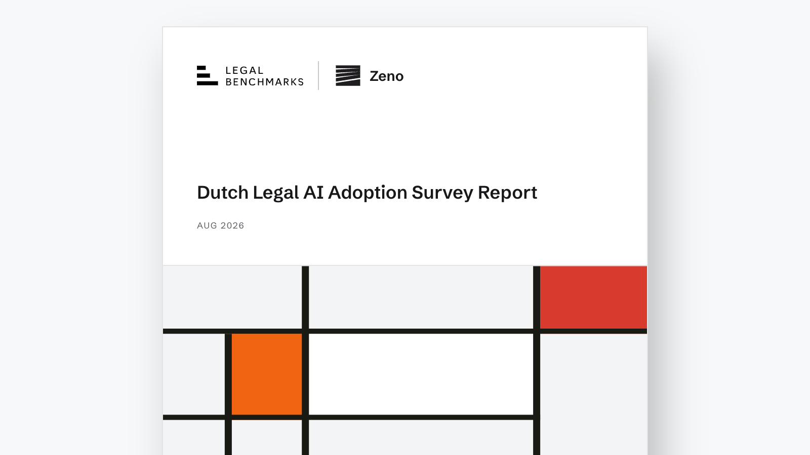
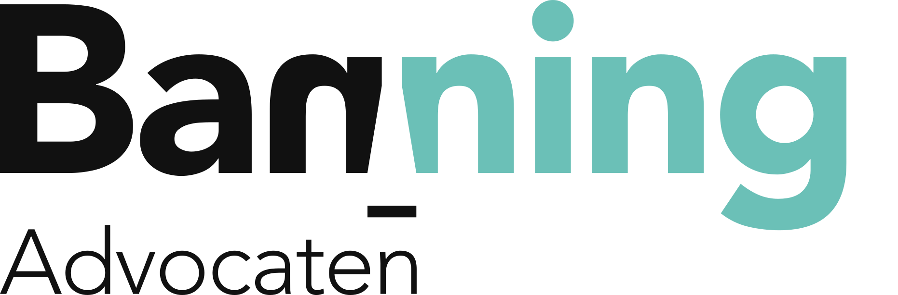
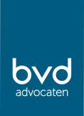
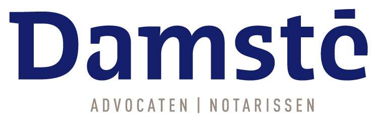
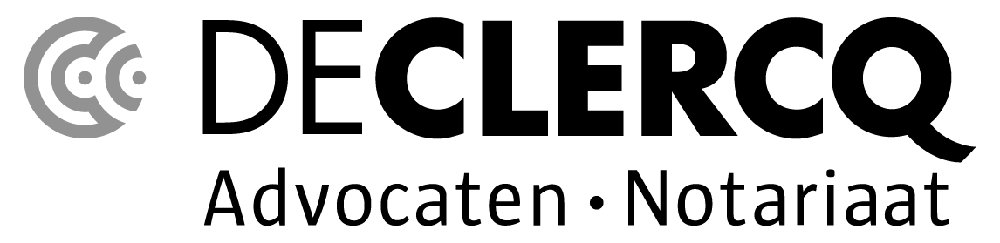
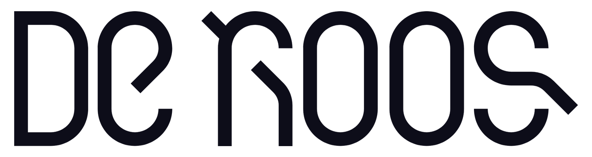
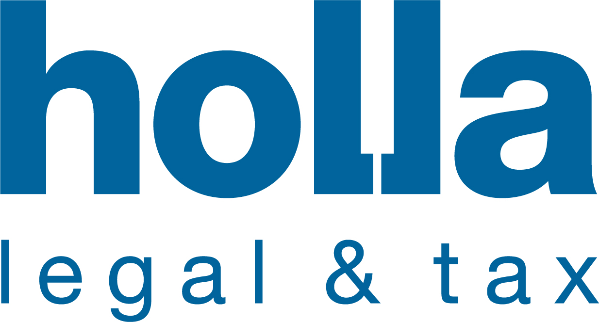
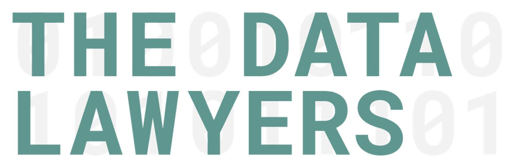
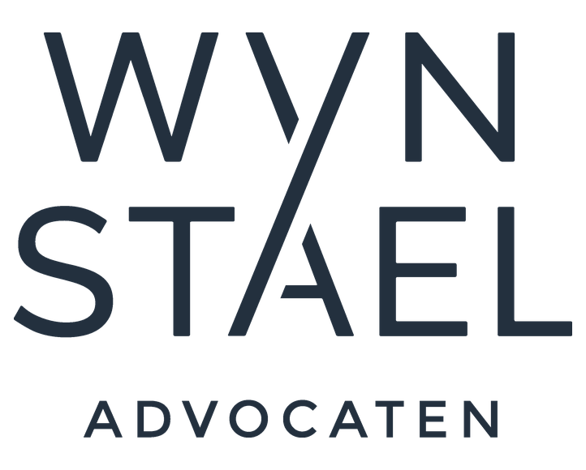

<p align="center">
  
</p>

<p align="center">
  DELTA: Dutch Legal AI Benchmark
</p>

<p align="center">
  
  
  <a href="https://github.com/legalbenchmarks/delta/actions/workflows/validate.yml"></a>
</p>

<p align="center">
  <em>Nederlands: <a href="README.nl.md">README.nl.md</a></em> · Not a GitHub user? <a href="https://drive.google.com/drive/folders/1zQn89pcsmAJ0-y9hy--TIbbkgXvUyZtN">Google Drive folder</a>
</p>

DELTA is a public, practitioner-led benchmark measuring how foundation models perform on realistic Dutch legal work. It asks not only whether AI gets the law right, but whether its work demonstrates **legal taste**: the professional judgment to identify what matters and deliver an answer a lawyer could use.

DELTA’s first public release focuses on open-ended legal research. The open-source task set was selected from more than 200 legal assignments reflecting questions encountered in Dutch practice. Benchmark results from the first public release will be published shortly.

More than 100 lawyers in the Netherlands helped shape DELTA. The accompanying survey report examines how Dutch lawyers use AI, the failures they encounter, the risks they consider most serious and when an answer remains professionally acceptable despite requiring correction.

DELTA is curated and maintained by [Legal Benchmarks](https://www.legalbenchmarks.ai/), with [Zeno](https://zeno.law/) as Founding Research Partner.

## Research

<!-- Cover geometry after Piet Mondrian. -->
<table>
<tr>
<td align="center"><a href="https://www.legalbenchmarks.ai/research/delta"></a><br><sub>Dutch Legal AI Adoption Survey Report</sub></td>
</tr>
</table>

## The tasks

Each task presents a question a Dutch lawyer could encounter in practice, posed in Dutch with an English reference translation. Practising Dutch lawyers reviewed the questions and scored model outputs. Their assessments informed the framework’s development and calibration.

Each task records its legal-research cut-off in `law_as_of`.

The assessment criteria fall into three categories:

- **Substance**: is the legal analysis correct, complete and professionally defensible
- **Citation**: is the controlling authority accurately identified
- **Form**: could a practitioner use the answer as delivered

**Legal taste crosses both substance and form.** The substance criteria capture professional judgment, including whether the answer identifies the decisive issues, distinguishes material points from distractions and calibrates caveats appropriately. The form criteria capture the final mile: whether the answer is prioritised, proportionate, structured and usable.

The form criteria deliberately codify task-specific professional preferences. If a criterion requires the conclusion in the opening paragraph or ancillary material to remain secondary, that is part of the published review standard for that assignment. These are explicit, observable and contestable requirements; judges may not introduce preferences that the criterion does not state.

For analysis, each non-citation criterion is also tagged with descriptive `dimensions`: legal correctness or legal judgment for substance, and usability or style for form. These tags describe what the criterion measures; the written criterion remains the sole grading standard.

| Practice area | Tasks | Criteria |
|---|---:|---:|
| [Tort law](tasks/tort-law) | 3 | 49 |
| [Property law](tasks/property-law) | 2 | 48 |
| [Corporate law](tasks/corporate-law) | 2 | 36 |
| [Insolvency & Restructuring](tasks/insolvency-restructuring) | 2 | 33 |
| [Real estate](tasks/real-estate) | 2 | 32 |
| [Contract law](tasks/contract-law) | 1 | 24 |
| [Employment law](tasks/employment-law) | 1 | 22 |
| [Competition law](tasks/competition-law) | 1 | 18 |
| [Family law](tasks/family-law) | 1 | 11 |

Every task is a folder under [`tasks/`](tasks); the whole set is also one machine-readable file, [`data/tasks.jsonl`](data/tasks.jsonl).

## How to use

Evaluating a system takes two pieces:

- a **harness** that puts each prompt to the system and records the answers
- a **judge** that grades the answers against the criteria

| Documentation | |
|---|---|
| [docs/harness.md](docs/harness.md) | Harness protocol, fixed prompt and record format |
| [docs/judge.md](docs/judge.md) | Grade the answers: axes, blind grading, metrics |
| [CONTRIBUTING.md](CONTRIBUTING.md) | Add tasks, dispute criteria |

## Contributing firms

<table>
<tr>
<td align="center" width="25%"><a href="https://www.banning.nl/"></a></td>
<td align="center" width="25%"><a href="https://www.bvd-advocaten.nl/"></a></td>
<td align="center" width="25%"><a href="https://www.damste.nl/"></a></td>
<td align="center" width="25%"><a href="https://declercq.com/"></a></td>
</tr>
<tr>
<td align="center"><a href="https://deroos.eu/"></a></td>
<td align="center"></td>
<td align="center"><a href="https://www.holla.nl/"></a></td>
<td align="center"><a href="https://www.hvglaw.nl/"></a></td>
</tr>
<tr>
<td align="center"><a href="https://ploum.nl/"></a></td>
<td align="center"><a href="https://www.thedatalawyers.com/"></a></td>
<td align="center"><a href="https://www.vaneps.com/"></a></td>
<td align="center"><a href="https://www.wijnenstael.nl/"></a></td>
</tr>
</table>

## Citation

If you use DELTA in your research, please cite it as:

```bibtex
@misc{delta_2026,
  title        = {Dutch Legal AI Benchmark (DELTA)},
  author       = {{Legal Benchmarks} and {Zeno.Law}},
  year         = {2026},
  howpublished = {\url{https://github.com/legalbenchmarks/delta}},
  note         = {Version 1.1.0}
}
```
